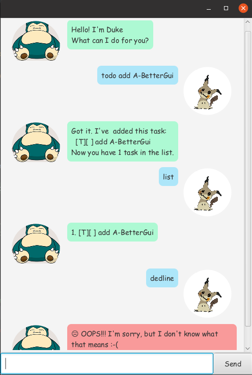

# User Guide - Duke
*Duke* is an app that helps *you* track and manage ***all*** your tasks!
## Contents
- [QuickStart](#quickstart)
- [Features](#features)
  - [List all tasks](#list-all-tasks)
  - [Add task](#add-task)
  - [Update task](#update-task)
  - [Delete task](#delete-task)
  - [Mark task as done](#mark-task-done)
  - [Find tasks](#find-tasks)
  - [Exit Duke](#exit-duke)
- [Usage](#usage)
  - [`bye`](#bye---exit-duke)
  - [`deadline`](#deadline---add-deadline-task)
  - [`delete`](#delete---delete-task)
  - [`done`](#done---mark-task-done)
  - [`event`](#event---add-event-task)
  - [`find`](#find---filter-tasks)
  - [`list`](#list---list-all-tasks)
  - [`todo`](#todo---add-todo-task)
  - [`update`](#update---update-task)

## QuickStart
1. Ensure that you have Java 11 or above installed in your computer.
2. Download the latest release from [here](https://github.com/lizchow/ip/releases/tag/A-Release).
3. Copy the file to the folder you want to use as the home folder for you Duke.
4. Run `java -jar duke.jar` in the terminal at the folder. The GUI should appear and look like something below
   after a few commands.  
   
5. Type in some command in the input box and press Enter. Here are some example commands:
   - `list`: List all the tasks
   - `todo try app` Add a Todo task with description `try app`
   - `bye`: Exit the app
6. Refer to the [Features](#features) sections for more features of Duke.

## Features 

### List All Tasks
List all the tasks in Duke.  
*Command*: [`list`](#list---list-all-tasks)

### Add Task
Add a task to the list of tasks in Duke.   
There are 3 types of tasks: 
- **Deadline**: Contains the description and deadline of task  
  *Command*: [`deadline [DESCRIPTION] /by [TIME]`](#deadline---add-deadline-task)
- **Event**: Contains the descriptions and start and end time of task  
  *Command*: [`event [DESRCRIPTION] /at [TIME]`](#event---add-event-task)
- **Todo**: Contains the description of task  
  *Command*: [`todo [DESCRIPTION]`](#todo---add-todo-task)

### Update Task
Update a task at the given index in Duke.  
*Command*: [`update INDEX [DESCRIPTION] [/date TIME]`](#update---update-task)

### Delete Task
Delete a task at the given index in Duke.   
*Command*: [`delete INDEX`](#delete---delete-task)

### Mark Task Done
Mark a task at the given index as done in Duke.  
*Command*: [`done INDEX`](#done---mark-task-done)

### Find Tasks
Returns a list of tasks that contains the search query in the **description** of the tasks.  
*Command*: [`find KEYWORD`](#find---filter-tasks)

### Exit Duke
Exit Duke and close the application.  
*Command*: [`bye`](#bye---exit-duke)

## Usage

### `bye` - Exit Duke
Exit the application.

Command: 

`bye`

Example of usage: 

`bye`

Expected outcome:

Displays exit message and the application closes.

```
Bye. Hope to see you again soon!
```

### `deadline` - Add Deadline Task
Adds a Deadline task to the list of tasks.
A deadline task contains the description and the deadline of the task.  
Note that deadline time should be in the format of `dd-M-YYYY HH:mm`.

Command: 

`deadline [DESCRIPTION] /by [TIME]`

Example of usage: 

`deadline return book /by 09-09-2021 17:00`

Expected outcome: 

Displays the new task and the number of tasks in Duke.

```
Got it. I've  added this task:
  [D][ ] return book (by: Sep 09 2021 5:00PM)
Now you have 1 tasks in the list.
```

### `delete` - Delete Task
Delete a task at the given index.
If no task exist at the index, Duke will display an error message.

Command:

`delete INDEX`

Example of usage:

`delete 1`

Expected outcome:

Displays the "deleted" task and number of tasks left.

```
Noted. I've removed this task:
  [D][ ] return book (by: Sep 09 2021 5:00PM)
Now you have 1 tasks in the list.
```

### `done` - Mark Task Done
Mark a task at the given index as done. 
If the task is already done, Duke will display an error message.

Command:

`done INDEX`

Example of usage:

`done 1`

Expected outcome:

Displays the "marked" task and success message.

```
Nice! I've marked this task as done:
  [D][X] return book (by: Sep 09 2021 5:00PM)
```
### `event` - Add Event Task
Adds an Event task to the list of tasks.
An event task contains the description and the start and end time of the task.  
Note that start and end time can be any string (i.e. `Monday 2-4pm`)

Command:

`event [DESCRIPTION] /at [TIME]`

Example of usage:

`event watch movie /at Monday 2-4pm`

Expected outcome:

Displays the new task and the number of tasks in Duke.

```
Got it. I've  added this task:
  [E][ ] watch movie (at: Monday 2-4pm)
Now you have 2 tasks in the list.
```

### `find` - Filter Tasks
Finds all the tasks with descriptions containing the search query.

Command:

`find [KEYWORD]`

Example of usage:

`find movie`

Expected outcome:

Displays all the tasks with the keyword.

```
Here are the matching tasks in your list:
1. [E][ ] watch movie (at: Monday 2-4pm)
```
### `list` - List All Tasks

List all the tasks in Duke.

Command:

`list`

Example of usage:

`list`

Expected outcome:

Displays all the tasks.

```
1. [D][ ] return book (by: Sep 09 2021 5:00PM)
2. [E][ ] watch movie (at: Monday 2-4pm)
```
### `todo` - Add Todo Task

Adds a Todo task to the list of tasks.
A Todo task contains the description of the task.

Command:

`todo [DESCRIPTION]`

Example of usage:

`todo finish report`

Expected outcome:

Displays the new task and the number of tasks in Duke.

```
Got it. I've  added this task:
  [T][ ] finish report
Now you have 3 tasks in the list.
```

### `update` - Update Task
Update the description and time of a task.
Note that the time format follows the type of the task 
(i.e. If the task is a **Deadline**, the time should be in `dd-M-YYYY HH:mm` 
and if it is a **Todo** task, a new time cannot be inserted.)

Command:

`update INDEX [DESCRIPTION] [/date time]`

Example of usage:

`update 2 watch Avenger /date Monday 10-12pm`

Expected outcome:

Displays the updated task.

```
Nice! I've updated this task:
  [E][ ] watch Avenger (at: Monday 10-12pm)
```
